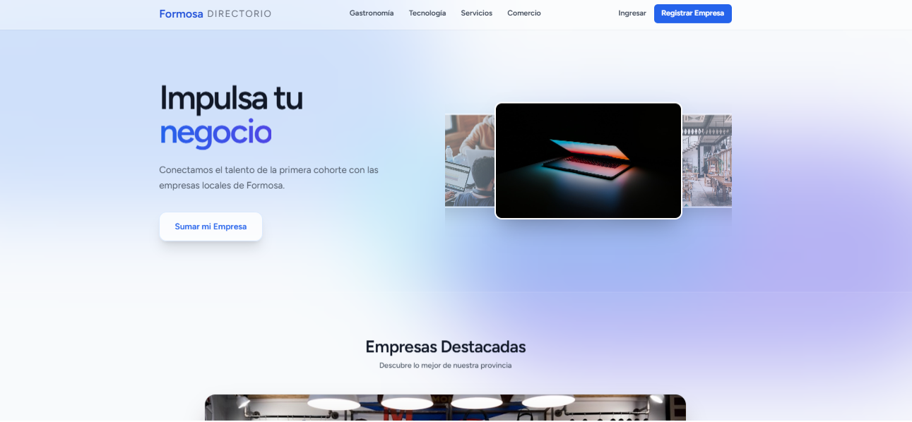

# 📍 Directorio de Empresas Formosa

Este sistema es una plataforma integral de vinculación empresarial desarrollada para conectar el sector productivo de la provincia de Formosa con el talento técnico local. Representa un hito en la digitalización regional, diseñado bajo estándares de escalabilidad y performance.

---

## 🛠️ Stack Tecnológico

| Tecnología | Descripción |
| :--- | :--- |
|  | Motor de procesamiento de servidor. |
|  | Framework robusto para el desarrollo del Backend y API. |
|  | Librería para la construcción de interfaces dinámicas. |
|  | Puente para crear Single Page Apps sin salir del flujo de Laravel. |
|  | Framework de estilos utilitarios para diseño responsivo. |
|  | Motor de base de datos relacional para la persistencia. |

---

## 🚀 Características Técnicas

### 1. Carrusel de Alto Impacto
Integración avanzada con **FlyonUI** y **Framer Motion**, permitiendo un desplazamiento infinito de empresas destacadas. Incluye lógica de nitidez forzada mediante selectores CSS específicos para las miniaturas activas.

### 2. Control de Visibilidad (CMS Ready)
El sistema implementa un filtrado de datos en el Frontend que valida el campo `publicado` de la base de datos (Boolean 0/1), asegurando que solo los comercios autorizados sean visibles para el usuario final.

### 3. Arquitectura de Datos Relacional
Diseño de base de datos normalizado con relaciones sólidas entre Categorías, Empresas y Usuarios.

---

## ⚙️ Instalación y Despliegue

### Requisitos Previos
- PHP >= 8.2
- Composer
- Node.js & NPM
- Servidor local (Laragon o similar)

### Configuración del Entorno
1. **Clonar el repositorio:**
   git clone https://github.com/Gerardomedinav/directorio_empresas.git
   cd directorio_empresas

2. **Instalar dependencias de PHP:**
   composer install

3. **Configurar variables de entorno:**
   cp .env.example .env
   php artisan key:generate

4. **Ejecutar migraciones y carga de datos:**
   php artisan migrate --seed

5. **Instalar dependencias de Frontend:**
   npm install
   npm install flyonui framer-motion axios

6. **Iniciar el entorno de desarrollo:**
   php artisan serve
   npm run dev

---

## 📂 Estructura de Archivos Clave

- `resources/js/components/EmpresaCard.jsx`: Lógica del carrusel y efectos de nitidez.
- `resources/js/Pages/Welcome.jsx`: Vista principal y filtrado dinámico de empresas.
- `database/migrations/`: Esquema técnico de la base de datos.

---

## 🤝 Flujo de Trabajo (Git Flow)

1. **Rama de Desarrollo:** `git checkout -b feature/nombre-mejora`
2. **Commit Semántico:** `git commit -m "feat: descripción del cambio"`
3. **Sincronización:** `git push origin feature/nombre-mejora`
4. **Fusión:** Apertura de Pull Request y revisión en GitHub.

---

## 🎓 Autor
**Gerardo Medina** - *Técnico Universitario en Programación (UTN)* Formosa, Argentina.